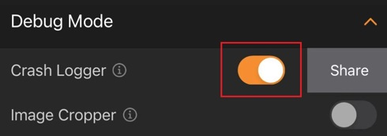

# How to use Debug Mode in Barcode Scanner X?

[<< Back to FAQ index](index.md)

## Debug Mode in BarcodeScannerX

If you are experiencing app crashes in your own application or you’ve come across some barcode(s) that you can’t read and you have exhausted all of the other troubleshooting methods, Debug Mode of the [BarcodeScannerX](https://www.dynamsoft.com/barcode-reader/sdk-mobile/#appDemo) demo app can help offer one last effort to resolve these issues.

This next section will explain how to toggle on debug mode on the demo app, and will then dive into how to collect crash logs and/or image samples.

1. From the home screen, go to Advanced Scan.

    

2. Tap the settings icon at the top-right corner.

    

3. Tap Debug Mode to see the drop-down list.

    

## Debug Mode - Crash Logger

If you are encountering an app crash caused by Dynamsoft Barcode Reader or Dynamsoft Camera Enhancer SDK, you need to use the Crash Logger.

1. Toggle on Crash Logger

    

2. After Crash Logger is toggled on, please go ahead and scan codes until you reproduce the crash issue.

3. After the app crashes, re-open BarcodeScannerX app and go to Advanced Scan -> settings. Tap the "Share" button to share the log files with the [Dynamsoft support team](https://www.dynamsoft.com/contact/?ver=latest).

    

## Debug Mode - Image Cropper

If you are having trouble reading barcodes, you should use the Image Cropper to capture some sample image(s) or frame(s) and send them to the Dynamsoft Support Team:

1. Toggle on Image Cropper

    

2. After Image Cropper is toggled on, an image crop icon will show up at the bottom left of Advanced Scan

    

3. Tap the image crop icon to crop and share the original frames with the [Dynamsoft support team](https://www.dynamsoft.com/contact/?ver=latest). Our support team will investigate the video frames and get back to you with a solution as soon as possible.
