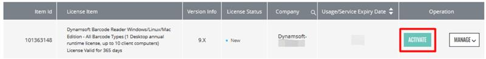
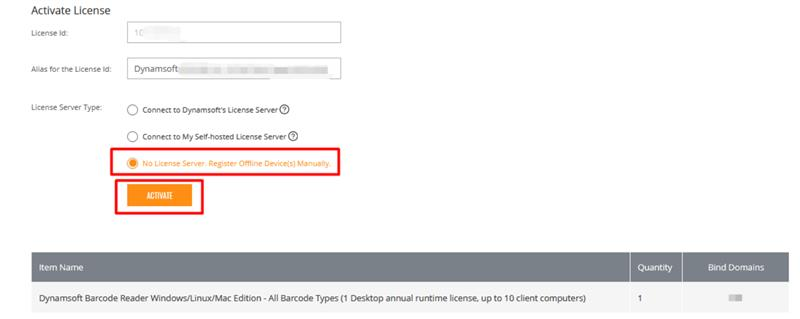
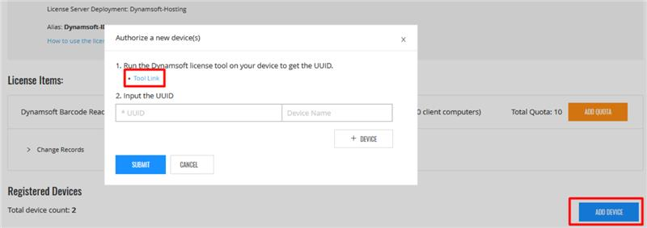
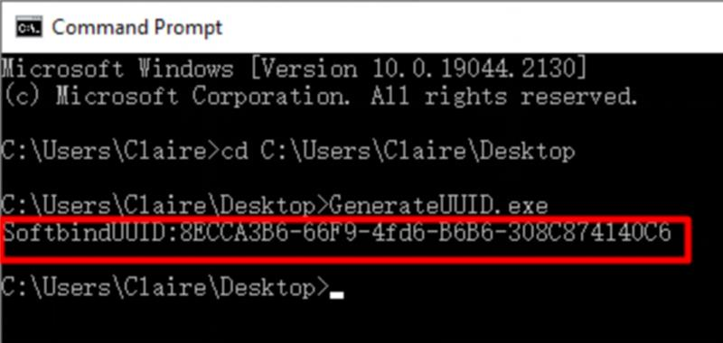
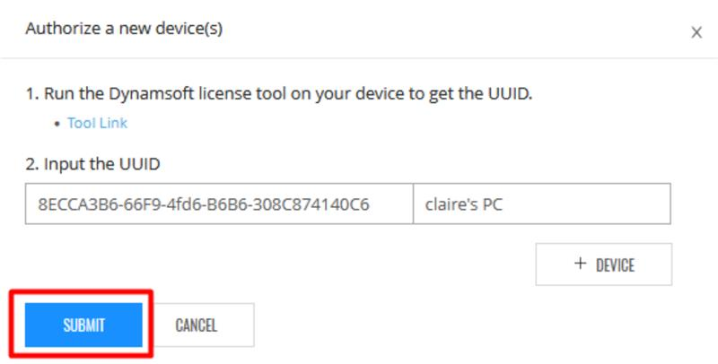
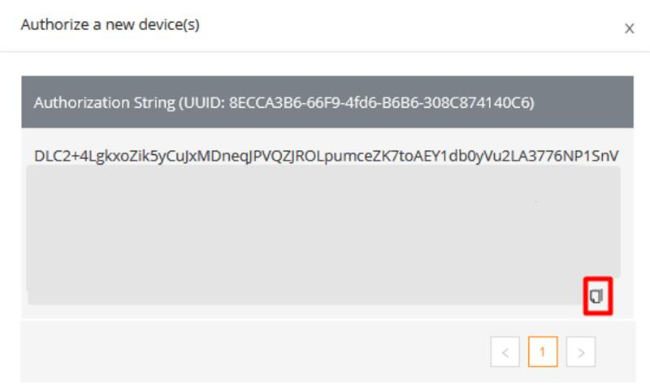

## How to use offline registration license type?

[<< Back to FAQ index](index.md)


You can follow the steps below to manually register the device and get the license key for each device:

1. Log in [Customer Portal](https://www.dynamsoft.com/customer/license/fullLicense) -> Click the Activate button to activate the license



2. Select the 3rd option "No License Server. Register Offline Device(s) Manually" and click Activate.


3. Click the Add Device button then it will pop up a dialog. Download the tool from the pop up.


4 Unzip the file and get amd run the GenerateUUID tool on the device to be registered and get the UUID.
For Windows:
-Open Command Prompt (cmd.exe)
-Change the working directory to the one where GenerateUUID.exe is
-Run the command `GenerateUUID.exe`
The returned string, e.g. 8ECCA3B6-66F9-4fd6-B6B6-308C874140C6, is the machine ID.



For Linux:
-Open Terminal
-Change the working directory to the one where GenerateUUID.exe is
-Run the command ` sudo chmod 777 GenerateUUID`
-After inputting the password, run `./GenerateUUID`
You will see the generated UUID like this (the ID should be different)
SoftbindUUID:230e089a-7dc3-4caa-9c77-f7cc6d567f9b
"230e089a-7dc3-4caa-9c77-f7cc6d567f9b" is the generated UUID. You can now use it to register the device and get an Authorization String for it.

> Note: If your device is an arm based architecture, please use get device uuid API to generate the uuid: 
> ```python
> # sample code in python
> print(BarcodeReader.get_device_uuid(1))
> ```

> Note: If you want multiple users in operating system to use the license, you will need to move the .Dynamsoft folder to a path where all the users can access. Let us say `/Home/shared/.Dynamsoft`.
> For all the programs in the devices, you will need to set the license cache path to `/Home/shared` before initialize the license
> ```python
> # set license cache path before initialize the license
> BarcodeReader.set_license_cache_path("/Home/shared")
> ```


5. Input the generated UUID and device name and click Submit.

6. Then an authorization string will be generated. This string is the license for this device. Copy the license and set it in the code


Code snippet in JavaScript:
```javascript
Dynamsoft.DBR.BarcodeScanner.license = "DLC2+4LgkxoZik5yCuJxMDneqJPVQZJROL…";
let scanner = await Dynamsoft.DBR.BarcodeScanner.createInstance();
```

Code snippet in C:
```C
  char errorBuf[512];
  DBR_InitLicense("DLC2+4LgkxoZik5yCuJxMDneqJPVQZJROL…", errorBuf, 512);
  void* barcodeReader = DBR_CreateInstance();
  // add further process
```
Code snippet in C++
```C++
  char errorBuf[512];
  dynamsoft::dbr::CBarcodeReader::InitLicense("DLC2+4LgkxoZik5yCuJxMDneqJPVQZJROL …", errorBuf, 512);
  CBarcodeReader* reader = new CBarcodeReader();
  // add further process
```
Code snippet in C#:
```C#
string errorMsg;
  BarcodeReader.InitLicense("DLC2+4LgkxoZik5yCuJxMDneqJPVQZJROL…", out errorMsg);
  BarcodeReader reader = new BarcodeReader();
  // add further process
```
Code snippet in Java:
```Java
  BarcodeReader.initLicense("DLC2+4LgkxoZik5yCuJxMDneqJPVQZJROL…");
  BarcodeReader reader = new BarcodeReader();
  // add further process
```
Code snippet in Python:
```Python
error = BarcodeReader.init_license("DLC2+4LgkxoZik5yCuJxMDneqJPVQZJROL…")
dbr = BarcodeReader()
```
Code snippet in Android SDK:
```java
BarcodeReader.initLicense("DLC2+4LgkxoZik5yCuJxMDneqJPVQZJROL…", new DBRLicenseVerificationListener() {
  @Override
  public void DBRLicenseVerificationCallback(boolean isSuccessful, Exception e) {
// Add your code for license verification.
  }
});
```
Code snippet in Objective-C:
```Objective-C
[DynamsoftBarcodeReader initLicense:@" DLC2+4LgkxoZik5yCuJxMDneqJPVQZJROL…" verificationDelegate:self];
- (void)DBRLicenseVerificationCallback:(bool)isSuccess error:(NSError *)error
{
  // Add your code for license verification.
}
```
Code snippet in Swift:
```Swift
DynamsoftBarcodeReader.initLicense("DLC2+4LgkxoZik5yCuJxMDneqJPVQZJROL…", verificationDelegate: self)
func dbrLicenseVerificationCallback(_ isSuccess: Bool, error: Error?)
{
  // Add your code for license verification.
}
```


