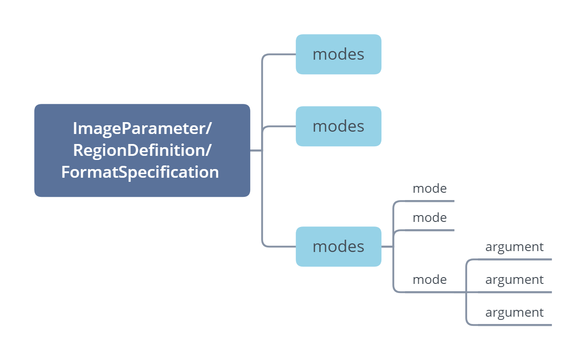
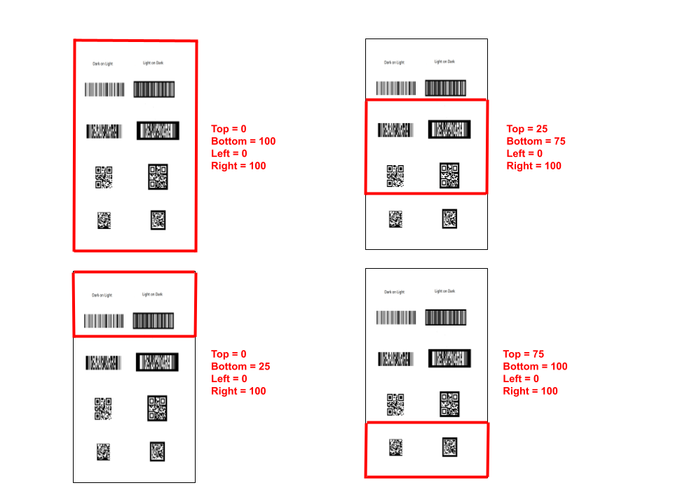
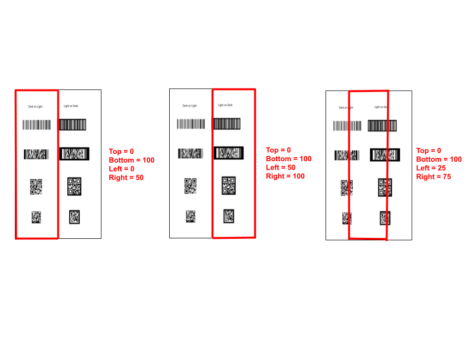
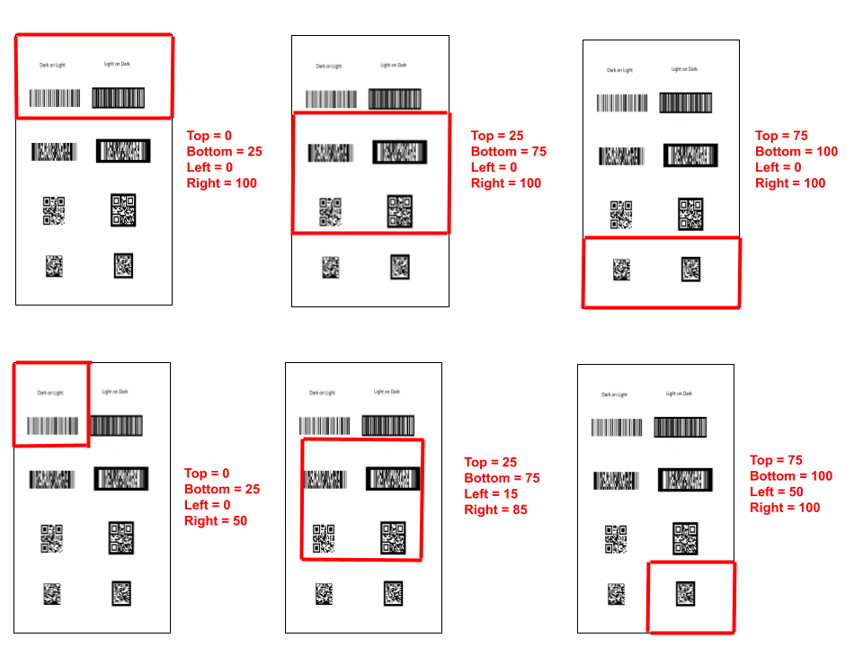

---   
description: Introduce the parameter definitions, organization structure, usage rules and related interfaces involved in Dynamsoft Barcode Reader.
title: Dynamsoft Barcode Reader Parameters - Structure and Interfaces of Parameters
keywords: Parameter,Interface,Hierarchy
layout: default-layout
needAutoGenerateSidebar: true
---


# Parameter Template Structure
This article introduces the parameter definitions, organization structure, usage rules, and related interfaces involved in Dynamsoft Barcode Reader.

## Definitions
Dynamsoft Barcode Reader uses a template to set parameters. A template contains three types of data: `ImageParameter`, `RegionDefinition`, and `FormatSpecification`.
- `ImageParameter` is used to specify the decoding settings on the entire image. The value of the `ImageParameter.Name` field is the unique identifier of the `ImageParameter`.
- `RegionDefinition` is used to specify a decoding region. It is also used to specify the decoding settings in this area. The value of the `RegionDefinition.Name` field is the unique identifier of `RegionDefinition`.
- `FormatSpecification` is used to specify a barcode format. It is also used to specify the decoding settings of this barcode format. The value of the `FormatSpecification.Name` field is the unique identifier of `FormatSpecification`.

## Organizational Relationship
- There is only one `ImageParameter` in a template definition. The `ImageParameter.Name` field denotes the unique identifier of the template;
- One or more `RegionDefinition` can be referenced through `RegionDefinitionNameArray` in `ImageParameter`;
- One or more `FormatSpecification` can be referenced through `FormatSpecificationNameArray` in `ImageParameter`;
- One or more `FormatSpecification` can be referenced through `FormatSpecificationNameArray` in `RegionDefinition`;
- In a JSON template file/string, you can use `ImageParameterContentArray`/`RegionDefinitionArray`/`FormatSpecificationArray` field to define multiple `ImageParameter`/`RegionDefinition`/`FormatSpecification`, for example:

```JSON
{
	"FormatSpecificationArray": [{
		"Name": "IP1_BF_QR_CODE"
	}],
	"ImageParameter": {
		"FormatSpecificationNameArray": [
			"IP1_BF_QR_CODE"
		],

		"Name": "default",

		"RegionDefinitionNameArray": [
			"region1"
		]
	},
	"RegionDefinition": {
		"Name": "region1"
	},
	"Version": "3.0"
}
```

## Scope
- When the same parameter is set in both `ImageParameter` and `RegionDefinition`, the decoding operation in the region specified by `RegionDefinition` is used; otherwise, the parameter values under the `ImageParameter` will be used.

- When the same parameter is set in both `ImageParameter` and `FormatSpecification`, the decoding operation for the barcode format specified by `FormatSpecification` is used; otherwise, the parameter values under the `ImageParameter` will be used.

- When the same parameter is set in both `RegionDefinition` and `FormatSpecification`, the decoding operation for the barcode format specified by `FormatSpecification` is used in the region specified by `RegionDefinition`; otherwise, the parameter values under the `ImageParameter` will be used.


## ImageParameter list
The parameters of `ImageParameter` are:

### Parameters Related to Searching for Regions of Interest

- ImageParameter.ColourClusteringModes
- ImageParameter.ColourConversionModes
- ImageParameter.GrayscaleTransformationModes
- ImageParameter.RegionPredetectionModes
- ImageParameter.ScaleDownThreshold


### Parameters Related to Localization of Rough Barcode Zones

- ImageParameter.BinarizationModes
- ImageParameter.ImagePreprocessingModes
- ImageParameter.LocalizationModes
- ImageParameter.TextFilterModes
- ImageParameter.TextureDetectionModes

### Parameters Related to Partition for Precise Barcode Zones

- ImageParameter.BarcodeColourModes
- ImageParameter.ScaleUpModes

### Parameters for Decoding

- ImageParameter.BarcodeComplementModes
- ImageParameter.DeblurLevel
- ImageParameter.DeblurModes
- ImageParameter.DeformationResistingModes
- ImageParameter.DPMCodeReadingModes

### Parameters Related to Results

- ImageParameter.ResultCoordinateType
- ImageParameter.ReturnBarcodeZoneClarity
- ImageParameter.TextResultOrderModes

### Parameters Related to Intermediate Result

- ImageParameter.IntermediateResultTypes
- ImageParameter.IntermediateResultSavingMode

### Parameters for the Overall Flow

- ImageParameter.ExpectedBarcodesCount
- ImageParameter.TerminatePhase
- ImageParameter.Timeout

### General

- ImageParameter.Name
- ImageParameter.Description
- ImageParameter.FormatSpecificationNameArray
- ImageParameter.RegionDefinitionNameArray

### Other

- ImageParameter.BarcodeFormatIds
- ImageParameter.BarcodeFormatIds_2
- ImageParameter.Pages
- ImageParameter.PDFRasterDPI
- ImageParameter.PDFReadingMode
- ImageParameter.MaxAlgorithmThreadCount


## RegionDefinition

The parameters of `RegionDefinition` are:
- RegionDefinition.BarcodeFormatIds
- RegionDefinition.BarcodeFormatIds_2
- RegionDefinition.Bottom
- RegionDefinition.ExpectedBarcodesCount
- RegionDefinition.FormatSpecificationNameArray
- RegionDefinition.Left
- RegionDefinition.MeasuredByPercentage
- RegionDefinition.Name
- RegionDefinition.Right
- RegionDefinition.Top

## FormatSpecification

The parameters of `FormatSpecification` are:
- FormatSpecification.AllModuleDeviation
- FormatSpecification.AustralianPostEncodingTable 
- FormatSpecification.BarcodeAngleRangeArray
- FormatSpecification.BarcodeBytesLengthRangeArray
- FormatSpecification.BarcodeBytesRegExPattern
- FormatSpecification.BarcodeComplementModes
- FormatSpecification.BarcodeFormatIds
- FormatSpecification.BarcodeFormatIds_2
- FormatSpecification.BarcodeHeightRangeArray
- FormatSpecification.BarcodeTextLengthRangeArray
- FormatSpecification.BarcodeTextRegExPattern
- FormatSpecification.BarcodeWidthRangeArray
- FormatSpecification.BarcodeZoneBarCountRangeArray
- FormatSpecification.BarcodeZoneMinDistanceToImageBorders
- FormatSpecification.Code128Subset
- FormatSpecification.DeblurLevel
- FormatSpecification.DeformationResistingModes
- FormatSpecification.FindUnevenModuleBarcode
- FormatSpecification.HeadModuleRatio
- FormatSpecification.MinQuietZoneWidth
- FormatSpecification.MinRatioOfBarcodeZoneWidthToHeight
- FormatSpecification.MinResultConfidence
- FormatSpecification.MirrorMode
- FormatSpecification.ModuleSizeRangeArray
- FormatSpecification.MSICodeCheckDigitCalculation
- FormatSpecification.Name
- FormatSpecification.RequireStartStopChars
- FormatSpecification.ReturnPartialBarcodeValue
- FormatSpecification.StandardFormat
- FormatSpecification.TailModuleRatio

## Parameter template files assignment rules 
When setting parameters through a JSON template, Dynamsoft Barcode Reader will process the template according to the following rules:
- Parameters not defined in `ImageParameter`/`RegionDefinition`/`FormatSpecification` will be filled with default values
- `FormatSpecification` is automatically split into multiple settings for a single barcode format, for example:

```JSON
Template you set
{
    "ImageParameter":{
        "Name": "ImageParameter1", 
        "BarcodeFormatIds": ["BF_ONED"],    
        "FormatSpecificationNameArray": [
          "FormatSpecification1"
        ]
    }, 
    "FormatSpecification": {
      "Name": "FormatSpecification1", 
      "BarcodeFormatIds": ["BF_CODE_39","BF_CODE_128"],
      "MinResultConfidence": 20
    }
}
```


```JSON
Template used by DBR
{
    "ImageParameter":{
        "Name": "ImageParameter1", 
        "BarcodeFormatIds": ["BF_ONED"],    
        "FormatSpecificationNameArray": [
          "FormatSpecification1_BF_CODE_39",
          "FormatSpecification1_BF_CODE_128"
        ]
    },
    "FormatSpecificationArray":[
      {
        "Name": "FormatSpecification1_BF_CODE_39", 
        "BarcodeFormatIds": ["BF_CODE_39"],
        "MinResultConfidence": 20
      },
      {
        "Name": "FormatSpecification1_BF_CODE_128", 
        "BarcodeFormatIds": ["BF_CODE_128"],
        "MinResultConfidence": 20
      }
    ] 
}
```

- When the two templates are merged, duplicate parameter settings in the defined `ImageParameter` are handled as follows:

  - The following parameters take the maximum of the two settings
    - DeblurLevel
    - ExceptedBarcodeCount 
    - MaxAlgorithmThreadCount
    - PDFRasterDPI
    - ScaleDownThreshold
    - Timeout  
  - The following parameters take the combined values of two settings
    - BarcodeFormatIds
    - BarcodeFormatIds_2 
    - IntermediateResultTypes
    - Pages
  - The following parameters are controlled by the `ConflictMode`. If `ConflictMode` is `IGNORE`, the first value is taken. If `ConflictMode` is `OVERWRITE`, the last value is taken
    - AccompanyingTextReadingModes
    - BarcodeColourModes
    - BarcodeComplementModes
    - BinarizationModes
    - ColourClusteringModes
    - ColourConversionModes
   	- DeblurModes
   	- DeformationResistingModes
    - DPMCodeReadingModes
    - GrayscaleTransformationModes
    - ImagePreprogressingModes
   	- IntermediateResultSavingMode
    - LocalizationModes
    - PDFReadingMode
    - RegionPredetectionModes
    - ResultCoordinateType
    - ReturnBarcodeZoneClarity
    - ScaleUpModes
    - TerminatePhase
    - TextFilterModes
    - TextResultOrderModes
    - TextureDetectionModes
    - RegionDefinitionNameArray: Take the last RegionDefinitionName in the last RegionDefinitionNameArray
    - FormatSpecificationNameArray: Take the combined value of the two settings, but if the FormatSpecification is set for the same barcode format, FormatSpecificationNameArray will only keep the name of the last FormatSpecification

## Modes, Mode and Arguments 
The entire decoding process of Dynamsoft Barcode Reader consists of many subdivided functions, among which the control parameters of some function blocks are designed in accordance with the format of Modes-Mode-Argument. That is, a function is controlled by a Modes parameter. There are many ways to implement this function, each method (Mode) has multiple unique settings, and each setting is an Argument. 

<div align="center">
   <p></p>
   
</div>   

For example, one of the functions in the decoding process is barcode localization. Dynamsoft Barcode Reader provides the `LocalizationModes` parameter to control this function. It provides `LM_CONNECTED_BLOCKS`, `LM_STATISTICS`, `LM_LINES`, `LM_SCAN_DIRECTLY`, `LM_STATISTICS_MARKS`, `LM_STATISTICS_POSTAL_CODE`, a total of 6 methods to implement barcode localization. For LM_SCAN_DIRECTLY, there are two Arguments, `ScanStride` and `ScanDirection`.

## Interfaces to change settings 

Dynamsoft Barcode Reader provides two ways to set parameters: `PublicRuntimeSettings` and JSON template files. 
`PublicRuntimeSettings` is used to modify the Dynamsoft Barcode Reader built-in template, and only supports commonly used parameters. The following are the steps to update Dynamsoft Barcode Reader parameters through `PublicRuntimeSettings`:

1. (optional) Restore the parameter settings of the Dynamsoft Barcode Reader built-in template to the default values through the `ResetRuntimeSettings` interface
2. Call the `GetRuntimeSettings` interface to get the current `PublicRuntimeSettings` of the Dynamsoft Barcode Reader object
3. Modify the contents in `PublicRuntimeSettings` in the previous step
4. Call the `UpdateRuntimeSettings` interface to apply the modified `PublicRuntimeSettings` in the previous step to the Dynamsoft Barcode Reader object
5. (optional) Call the `SetModeArgument` interface to set the optional argument for a specified mode in Modes parameters.


JSON templates supports all Dynamsoft Barcode Reader parameters. The related parameter setting interfaces are:
- `InitRuntimeSettingsWithFile`: After calling this interface, the template definition in the file are processed according to the merging rules stated in the "Multiple parameter template files" section. Each independent template is stored in the Dynamsoft Barcode Reader object. All templates are merged into one template, then replace the built-in template of Dynamsoft Barcode Reader;
- `InitRuntimeSettingsWithString`: The effect after calling this interface is the same as `InitRuntimeSettingsWithFile`. The only difference is the template definition of `InitRuntimeSettingsWithString` is saved as a string;
- `AppendTplFileToRuntimeSettings`: After calling this interface, the template definition in the file will be processed according to the merging rules stated in the "Multiple parameter template files" section . Each independent template is stored in the Dynamsoft Barcode Reader object. All templates, including Dynamsoft Barcode Reader's built-in template, are merged into one template to replace the built-in template of Dynamsoft Barcode Reader;
- `AppendTplStringToRuntimeSettings`: The effect after calling this interface is the same as `AppendTplFileToRuntimeSettings`. The only difference is the template definition of `AppendTplStringToRuntimeSettings` is saved as a string.

## RegionDefinition and How It Works
Limiting the reading area of the barcode reader instance can help provide a better scanning UI as well optimize the performance of the SDK. It is important to understand how the RegionDefinition interface works, and what exactly you need to consider when coming up with the region percentage values.

By definition, the `top` parameter of the RegionDefinition is used to represent the top-most coordinate of the region, while `bottom` represents the bottom-most coordinate of the region. But how do you figure out the appropriate values to set them?

In order to set these values, we highly recommend setting `MeasuredByPercentage` to 1 to make this process as easy as possible. The next section assumes that this parameter is set to true.

For `top` and `bottom`, think of the height of the image or frame as a **vertical axis** that goes from 0 to 100:
- 0 represents the top-most point of the image or frame
- 100 represents the bottom-most point of the image or frame.

Please follow this diagram for a visual representation of different regions with various `top` and `bottom` values:

<div align="center">
  
</div>

Please note that the above diagram is not limiting the horizontal view at all.

After determining where you want the top-most and bottom-most points of the reading region, you can find its corresponding percentage value either by trial and error (and using the naked eye) or you can take exact measurements and use those to calculate the exact percentage values.

Now for `left` and `right`, think of the width of the image or frame as a **horizontal axis** that goes from 0 to 100:
- 0 represents the left-most point of the image of frame
- 100 represents the right-most point of the image of frame

<div align="center">
  
</div>

The above diagram represents various percentages and their visual representation. This assumes that you are not restricting the vertical area and leaving `top` and `bottom` unaffected.

Now let's group them all together to demonstrate various scanerios and their corresponding values

<div align="center">
  
</div>

And that is pretty much a gist of how the RegionDefinition works. If anything is unclear, please contact support.

## Using Runtime Settings Templates
When getting started with the runtime settings, it could be a bit overwhelming given how many settings there are and the different scenarios in which they apply.

To make things easier, we introduced four general modes to represent the `RuntimeSettings`:
- `speed`: configures the SDK to read the image or frame as fast as possible, disregarding accuracy. This mode is not recommended for 2D codes in general, but specifically PDF417 codes.
- `coverage`: opposite to `speed`, this mode prioritizes accuracy by sacrificing speed.
- `balance`: As the name suggests, this mode offers the best of the two modes, achieving a good combination of the two extremes.
- `single`: This is the default setting which is optimized for detecting one barcode from video input.

When using the [JavaScript edition](https://www.dynamsoft.com/barcode-reader/programming/javascript/), the `RuntimeSettings` can be updated to any one of the four templates directly instead of having to update each `RuntimeSetting` individually. Please check out the corresponding [documentation](https://www.dynamsoft.com/barcode-reader/programming/javascript/api-reference/BarcodeReader.html?ver=latest#updateruntimesettings) for more info. *Please note  that updating the runtime settings using a preset template is currently only supported by the JavaScript edition.*

Please refer to the following breakdown the difference in the individual `RuntimeSettings` between the four modes, as well as the default settings

| Parameter | `speed` | `balance` | `coverage` | `single` |
| :-: | :-: | :-: | :-: | :-: |
| `DeblurModes` |  `[DM_BASED_ON_LOC_BIN, DM_THRESHOLD_BINARIZATION, DM_DIRECT_BINARIZATION]` |  `[DM_BASED_ON_LOC_BIN, DM_THRESHOLD_BINARIZATION,` <br /> `DM_DIRECT_BINARIZATION, DM_SMOOTHING]`|  `[DM_BASED_ON_LOC_BIN, DM_THRESHOLD_BINARIZATION,`<br />` DM_DIRECT_BINARIZATION, DM_SMOOTHING,`<br />` DM_GRAY_EQUALIZATION, DM_MORPHING, DM_DEEP_ANALYSIS]` | `[DM_BASED_ON_LOC_BIN, DM_THRESHOLD_BINARIZATION,`<br />` DM_DIRECT_BINARIZATION, DM_SMOOTHING,` <br />`DM_GRAY_EQUALIZATION, DM_MORPHING, DM_DEEP_ANALYSIS]` |
| `BarcodeFormatIds_2` |  `BF2_POSTALCODE` 	|  `BF2_POSTALCODE` 	|  `BF2_POSTALCODE` | `BF2_NULL` |
| `ExpectedBarcodesCount` |  `512` 	|  `512` 	|  `512` | `1` |
| `GrayscaleTransformationModes` | `[GTM_ORIGINAL, 0, 0, 0, 0, 0, 0, 0]` 	| `[GTM_ORIGINAL, 0, 0, 0, 0, 0, 0, 0]` 	 | `[GTM_ORIGINAL, GTM_INVERTED, 0, 0, 0, 0, 0, 0]` | `[GTM_ORIGINAL, 0, 0, 0, 0, 0, 0, 0]` |
| `TextFilterModes` | `[0, 0, 0, 0, 0, 0, 0, 0]` 	 | `[TFM_GENERAL_CONTOUR, 0, 0, 0, 0, 0, 0, 0]` 	 | `[TFM_GENERAL_CONTOUR, 0, 0, 0, 0, 0, 0, 0]` | `[TFM_GENERAL_CONTOUR, 0, 0, 0, 0, 0, 0, 0]` |
| `LocalizationModes` | `[LM_CONNECTED_BLOCKS, LM_STATISTICS_MARKS, LM_STATISTICS_POSTAL_CODE, 0, 0, 0, 0, 0]` 	 | `[LM_CONNECTED_BLOCKS, LM_STATISTICS, LM_STATISTICS_MARKS,`<br />` LM_STATISTICS_POSTAL_CODE, 0, 0, 0, 0]` | `[LM_CONNECTED_BLOCKS, LM_SCAN_DIRECTLY,`<br />` LM_STATISTICS, LM_LINES,`<br />` LM_STATISTICS_MARKS, LM_STATISTICS_POSTAL_CODE, 0, 0]` | `[LM_CONNECTED_BLOCKS, LM_SCAN_DIRECTLY,`<br />` LM_STATISTICS, LM_LINES, 0, 0, 0, 0]` |
| `ScaleDownThreshold` | `2300` 	| `2300` 	| `214748347` | `2300` |
