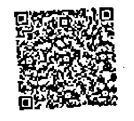

# What makes Dynamsoft Barcode Reader flexible and extensible

In this article, we will explain in detail what makes Dynamsoft Barcode Reader (Abbreviated as "DBR") flexible and extensible. The most critical design is the **parameters template**.

## Parameters Template

DBR classifies and organizes a series of algorithm/result control parameters to form a flexible and extensible **parameters template**. The **top-level objects**, as a set of **detailed parameters**, are organized as three parts: `ImageParameter`, `RegionDefinition`, and `FormatSpecification`.
- `ImageParameter` is used to specify the preprocessing/localization/decoding/postprocessing parameters on the target image. The value of the `ImageParameter.Name` field is the unique identifier of the `ImageParameter`.
- `RegionDefinition` is used to specify a decoding region. It is also used to specify the decoding parameters in this area. The value of the `RegionDefinition.Name` field is the unique identifier of `RegionDefinition`.
- `FormatSpecification` is used to specify a barcode format. It is also used to specify the decoding parameters of this barcode format. The value of the `FormatSpecification.Name` field is the unique identifier of `FormatSpecification`.

The following simple example reflects the relationship between top-level objects:

```JSON
{
	"FormatSpecificationArray": [{
		"Name": "IP1_BF_QR_CODE"
	}],
	"ImageParameter": {
		"FormatSpecificationNameArray": [
			"IP1_BF_QR_CODE"
		],

		"Name": "default",

		"RegionDefinitionNameArray": [
			"region1"
		]
	},
	"RegionDefinition": {
		"Name": "region1"
	},
	"Version": "3.0"
}
```

The **detailed parameters** of DBR parameters template are mainly divided into two types: **General Parameters** and **Special Parameters(Modes)**.

## General Parameters

Barcodes can be described from the following characteristics: barcode format, barcode size, barcode direction, barcode module size, barcode quiet zone, barcode length and barcode content etc. Next, I will take these features as an example to introduce the corresponding design parameters of DBR.

### Barcode Format

[BarcodeFormatIds]({{ site.parameters_reference }}barcode-format-ids.html) is a parameter to specify the formats of the barcode in BarcodeFormat group 1 to be read. It is a combined value of [`BarcodeFormat` Enumeration]({{ site.enumerations }}format-enums.html#barcodeformat) items.
[BarcodeFormatIds_2]({{ site.parameters_reference }}barcode-format-ids-2.html) is a parameter to specify the formats of the barcode in BarcodeFormat group 2 to be read. It is a combined value of [`BarcodeFormat_2` Enumeration]({{ site.enumerations }}format-enums.html#barcodeformat_2) items.

**Remarks**  
- The default value is all supported barcode formats in BarcodeFormat group 2.
- The barcode format our library will search for is composed of [BarcodeFormat group 1]({{ site.enumerations }}format-enums.html#barcodeformat) and [BarcodeFormat group 2]({{ site.enumerations }}format-enums.html#barcodeformat_2), so you need to specify the barcode format in group 1 and group 2 individually.

### Barcode Size

[BarcodeWidthRangeArray]({{ site.parameters_reference }}barcode-height-range-array.html) is a parameter to specify the range of widths (in pixels) for barcodes searching and result filtering. It is not set by default which means there is no limitation on the barcode widths.
[BarcodeHeightRangeArray]({{ site.parameters_reference }}barcode-width-range-array.html) is a parameter to specify the range of heights (in pixels) for barcodes searching and result filtering. It is not set by default which means there is no limitation on the barcode heights.

### Barcode Direction

[BarcodeAngleRangeArray]({{ site.parameters_reference }}barcode-angle-range-array.html) is a parameter to specify the range of angles (in degrees) for barcodes searching and result filtering. It is not set by default which means there is no limitation on the barcode angles.

### Barcode Module Size

[ModuleSizeRangeArray]({{ site.parameters_reference }}module-size-range-array.html) is a parameter to specify the range of module size (in pixels) for barcodes searching and result filtering. It is not set by default which means there is no limitation on the barcode module size.

### Barcode Quite Zone

[MinQuietZoneWidth]({{ site.parameters_reference }}min-quiet-zone-width.html) is a parameter to specify the minimum width (in moduleSize) of the barcode quiet zone. It is defined as below:

| Value Type | Value Range | Default Value |
| ---------- | ----------- | ------------- |
| *int* | [0, 0x7fffffff] | 4 |

**Remarks**  
- The unit is barcode module size. For example, if barcode module is 2px and MinQuietZoneWidth is 4, then the width of quiet zone is 8px.

   
### Barcode Text Rules

[BarcodeBytesLengthRangeArray]({{ site.parameters_reference }}barcode-bytes-length-range-array.html) is a parameter to specify the range of barcode bytes length for barcodes searching and result filtering. It is not set by default which means there is no limitation on the barcode byte length.

[BarcodeTextLengthRangeArray]({{ site.parameters_reference }}barcode-text-length-range-array.html) is a parameter to specify the range of barcode text length for barcodes searching and result filtering. It is not set by default which means there is no limitation on the barcode text length.

[BarcodeTextRegExPattern]({{ site.parameters_reference }}barcode-text-regex-pattern.html) is a parameter to specify the regular express pattern of barcode text characters for barcodes searching and result filtering. It is not set by default which means there is no limitation on the barcode text characters.

## Special Parameters (Modes)

**Modes** are a series of special parameters, which are used to complete a specific image processing task, such as image grayscale, binarization, text removal, barcode localization, barcode deblur, etc. The core concept of **Modes** contains three levels: **Modes**, **Mode** and **Argument**. The relationship between them is shown in the following figure:

<div align="center">
   
    <p>Figure 1 – Modes, Mode, Arguments relationship</p>
</div> 

### Build-in processing modes

DBR provides various build-in processing modes at each stage of the algorithm to maintain great flexibility. They could be divide into two categories: **Common Modes** And **DBR-oriented Modes**. The common modes are mainly used for image preprocessing like image grayscale, image binarization, image enhancement, texture filtering, text filtering, etc. The DBR-oriented modes are mainly used for barcode-oriented processing, such as barcode localization, barcode deblurring, barcode complement, barcode anti-deformation, etc. 

Let’s take [`BinarizationModes`]({{ site.parameters_reference }}binarization-modes.html#binarizationmodes) as an example to illustrate. This parameter helps control the process of converting grayscale image into binary image. A better binary image helps a lot for barcode reading. DBR provides two  binarization modes: `BM_THRESHOLD` and `BM_LOCAL_BLOCK`.

**BM_THRESHOLD** 

`BM_THRESHOLD` uses a global threshold to binarize the image. If the gray value of the pixel is less than the threshold, it will be black in the binary image, otherwise it will be white.

**BM_LOCAL_BLOCK**

As mentioned above, we use a unified threshold for binarization, but this might not be good in all cases. If an image has different lighting conditions in different areas, `BM_LOCAL_BLOCK` can help. In this case, our algorithm determines the threshold for a pixel based on a small region around it, which makes it more adaptive and gives better results.


For example, the picture below has different lighting conditions in different areas. If we use BM_THRESHOLD to set a global value as a threshold, it will be difficult to yield good results. In this case, it is more suitable to use BM_LOCAL_BLOCK to set an adaptive binarization threshold. 
    
<div align="center">

<p>Figure 2 – original image</p>
</div>

The following images show the effects of BM_THRESHOLD (global thresholding) and BM_LOCAL_BLOCK (adaptive thresholding) individually for an image with varying illumination:

<div align="center">

<p>Figure 3 – binarization result of BM_THRESHOLD</p>
</div>

<div align="center">

<p>Figure 4 – binarization result of BM_LOCAL_BLOCK</p>
</div>

It can be seen that different binarazation mode can handle different scenarios. `BM_THRESHOLD` is simpler and faster, but it is less universal; on the contrary, `BM_LOCAL_BLOCK` is a bit slower but more universal.

The complete built-in common modes are as follows:

| **Modes Name** | **Functionality** | **Status** |
| ------------------ | ---------------------------- | ---------- |
| [`ColourClusteringModes`]({{ site.parameters_reference }}colour-clustering-modes.html#colourclusteringmodes) | To categorize colours into a few colours representing background or foreground. | Available, Extensible |
| [`ColourConversionModes`]({{ site.parameters_reference }}colour-conversion-modes.html#colourconversionmodes) | To set the conversion from colour to grayscale, which keeps or enhances the features of the region of interest. | Available, Extensible |
| [`GrayscaleTransformationModes`]({{ site.parameters_reference }}grayscale-transformation-modes.html#grayscaletransformationmodes) | To emphasize the features of regions of interest with processing of the grayscale image. | Available, Extensible |
| [`RegionPredetectionModes`]({{ site.parameters_reference }}region-predetection-modes.html#regionpredetectionmodes) | To limit the subsequent stages in special areas to speed up by detecting the regions of interest automatically. Pre-detection is based on the colour/grayscale distribution of each area. | Available, Extensible |
| [`ImagePreprocessingModes`]({{ site.parameters_reference }}image-preprocessing-modes.html#imagepreprocessingmodes) | To enhance/keep features of barcode zones by processing grayscale images. | Available, Extensible |
| [`BinarizationModes`]({{ site.parameters_reference }}binarization-modes.html#binarizationmodes) | To enhance/keep features of barcode zones by applying different binarization methods and arguments. | Available, Extensible |
| [`TextureDetectionModes`]({{ site.parameters_reference }}texture-detection-modes.html#texturedetectionmodes) | To reduce the time cost and error probability caused by textures that resemble 1D barcodes. | Available, Extensible |
| [`TextFilterModes`]({{ site.parameters_reference }}text-filter-modes.html#textfiltermodes) | To exclude the text from barcodes and reduce time cost. | Available, Extensible |

The complete built-in DBR-oriented modes are as follows:

| **Modes Name** | **Functionality** | **Status** |
| ------------------ | ---------------------------- | ---------- |
| [`LocalizationModes`]({{ site.parameters_reference }}localization-modes.html) | Control how to localize barcodes. It consisits of one or more modes, each mode represents a way to implement the localization. |Available, Extensible |
| [`DeblurModes`]({{ site.parameters_reference }}deblur-modes.html#deblurmodes) | To apply a variety of image processing methods to sample modules. The smaller index is, the higher priority is. | Available |
| [`BarcodeColourModes`]({{ site.parameters_reference }}barcode-colour-modes.html) | Sets the mode and priority for the barcode colour mode used to process the barcode zone. | Available |
| [`BarcodeComplementModes`]({{ site.parameters_reference }}barcode-complement-modes.html#barcodecomplementmodes) | To detect and complete a barcode with missing border modules. | Available for QRCode and DataMatrix |
| [`DeformationResistingModes`]({{ site.parameters_reference }}deformation-resisting-modes.html#deformationresistingmodes) | To detect and restore a two-dimensional barcode from deformation. | Available for QRCode and DataMatrix |
| [`DPMCodeReadingModes`]({{ site.parameters_reference }}dpm-code-reading-modes.html#dpmcodereadingmodes) | To separate and identify modules of a DPM barcode. | Available for DataMatrix |
| [`TextResultOrderModes`]({{ site.parameters_reference }}text-result-order-modes.html#textresultordermodes) | To sort the results according to certain factors. | Available |

### Mode arguments to fine-tune the effect

Generally, each mode has some arguments which can well control the processing effect. 

Let's continue to illustrate with [`BinarizationModes`]({{ site.parameters_reference }}binarization-modes.html#binarizationmodes) as an example. The `BM_LOCAL_BLOCK` mode determines the threshold for a pixel based on a small region around it, which makes it more adaptive and gives better results. The two most important arguments are as follows:

- BlockSizeX
- BlockSizeY

You can set the width and height of neighbour pixels when calculating the binarization threshold. Generally, it is recommended to set BlockSizeX and BlockSizeY to 5 - 8 times ModuleSize.

In the following JSON template, we configured two different binarization modes (same mode with different arguments) to convert grayscale images to binarization images.

```json
{
    "ImageParameter": {
        "BinarizationModes": [
	        // Use the default arguments of BM_LOCAL_BLOCK
            {
                "Mode": "BM_LOCAL_BLOCK"
            }, 
	        // Use customed blocksize on BM_LOCAL_BLOCK
            {
                "Mode": "BM_LOCAL_BLOCK", 
                "BlockSizeX": 11, 
                "BlockSizeY": 11
            }
        ]
    }, 
    "Version": "3.0"
}
```

The following is an original grayscale image. We will use the above settings in the template to do the binarization process.

<div align="center">

<p>Figure 5 – original grayscale image</p>
</div>

The followings show the binarization image using the default arguments on BM_LOCAL_BLOCK. 

<div align="center">

<p>Figure 6 – default binarization image</p>
</div>

Apparently, the three finder patterns of the QR Code have been destroyed, resulting in the failure to localize the QR code. 

The following show the binarization image using the customed arguments on BM_LOCAL_BLOCK. In this image, the finder patterns of the QR Code are very clear and can be successfully localized and decoded.

<div align="center">

<p>Figure 7 – customed binarization image</p>
</div>

Generally, even in the same mode, you can configure different mode arguments according to your needs to achieve different effects.

### Mode arguments for pruning cycles

DBR executes these modes in a certain order, so there may be dependencies between different modes. Let's take `ImagePreprocessModes` and `BinarizationModes` as examples to illustrate the dependencies.`ImagePreprocessModes` is designed to enhance/keep features of barcode zones by processing grayscale images. It is the pre-step of `BinarizationModes`, so the `BinarizationModes` depend on the processing results of `ImagePreprocessModes`. 

Assuming that there are both 3 elements defined in the `ImagePreprocessModes` and `BinarizationModes` parameters, the SDK will loop 9 cycles by default. However, when the `ImagePreprocessModesIndex` argument in `BinarizationModes` is specified as the corresponding `ImagePreprocessModes` index, assuming one-to-one here, only 3 cycles are required, which greatly reduces the computational cost.

### Extensible user-defined modes

In addition to the built-in modes, DBR also supports user-defined modes to suit your special scenarios. First, you need to develop a dynamic link library(.dll under windows or .so under linux) whose interface conforms to the DBR specification. Second, you need to configure the custom mode in your parameters template file. The `LibraryFileName` argument of the custom mode should be specified as the path of the dynamic link library file, and if extra arguments are to be passed, the `LibraryParameters` parameter should be specified. Therefore, when the algorithm flow enters the stage of processing the custom mode, DBR will dynamically load the library and execute the corresponding logic.

## Summary

In this article, we introduce from the following aspects what makes DBR flexible and extensible:

- Paramters template
- General Parameters
- Special Parameters (Modes)

In reality, speed, read rate and accuracy are the three most important performance indicators. Read our other documents dedicated to these three topics:

* [How to boost Speed](https://www.dynamsoft.com/barcode-reader/performance/speed.html)
* [How to boost Read Rate](https://www.dynamsoft.com/barcode-reader/performance/read-rate.html)
* [How to boost Accuracy](https://www.dynamsoft.com/barcode-reader/performance/accuracy.html)
