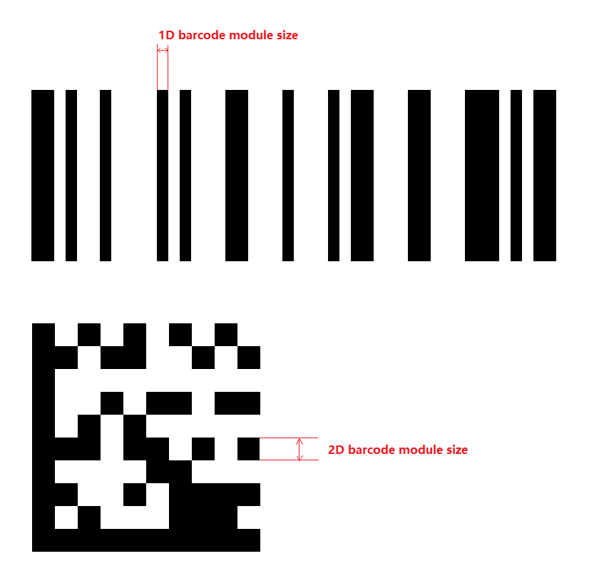

# How to read barcodes with small module size

A module is the narrowest "bar" in a 1D barcode, or the smallest "box" in a 2D barcode. Keep in mind this "bar" or "box" can be either light or dark. The figure below illustrates the module size of 1d and 2d barcodes.

<div align="center">
   <p></p>
   <p>Figure 1 – Module size of 1D and 2D barcodes</p>
</div>

In some scenarios, the barcode is very small relative to the entire image, and its module size is even smaller, which makes it difficult for our library to read the barcode. In this case, we can use the parameter `ScaleUpMode` in `PublicRuntimeSettings.scaleUpModes` to enlarge the barcode symboal for easier processing.

<div class="sample-code-prefix template2"></div>
   >- JavaScript
   >- Android
   >- Objective-C
   >- Swift
   >- Python
   >- Java
   >- C#
   >- C++
   >- C
   >
>
```javascript
// Obtains the current runtime settings of DBR.
let rs = await scanner.getRuntimeSettings();
// Sets the scale-up mode.
rs.scaleUpModes[0] = Dynamsoft.DBR.EnumScaleUpMode.SUM_LINEAR_INTERPOLATION;
// Updates the settings.
await scanner.updateRuntimeSettings(rs);
// Fine-tunes some arguments of the first mode in `scaleUpModes`
scanner.setModeArgument("scaleUpModes", 0, "AcuteAngleWithXThreshold", "0");
scanner.setModeArgument("scaleUpModes", 0, "ModuleSizeThreshold", "3");
scanner.setModeArgument("scaleUpModes", 0, "TargetModuleSize", "8");
await scanner.show();
```
>
```java
// Obtain current runtime settings of `reader` instance.
PublicRuntimeSettings settings = reader.getRuntimeSettings();
// Enable a scale up mode
settings.scaleUpModes = new int[]{ EnumScaleUpMode.SUM_LINEAR_INTERPOLATION };
// Update the settings.
reader.updateRuntimeSettings(settings);
// Fine-tune some arguments of the first mode in `ScaleUpModes`
reader.setModeArgument("scaleUpModes", 0, "AcuteAngleWithXThreshold", "0");
reader.setModeArgument("scaleUpModes", 0, "ModuleSizeThreshold", "3");
reader.setModeArgument("scaleUpModes", 0, "TargetModuleSize", "8");
```
>
```objc
NSError* err = nil;
// Obtain current runtime settings of `reader` instance.
iPublicRuntimeSettings* settings = [reader getRuntimeSettings:&err];
// Enable a scale up mode
settings.scaleUpModes = @[@(EnumScaleUpModeLinearInterpolation)];
// Update the settings.
[reader updateRuntimeSettings:settings error:&err];
// Fine-tune some arguments of the first mode in `ScaleUpModes`
[reader setModeArgument:@"scaleUpModes" index:0 argumentName:@"AcuteAngleWithXThreshold" argumentValue:@"0" error:nil];
[reader setModeArgument:@"scaleUpModes" index:0 argumentName:@"ModuleSizeThreshold" argumentValue:@"3" error:nil];
[reader setModeArgument:@"scaleUpModes" index:0 argumentName:@"TargetModuleSize" argumentValue:@"8" error:nil];
```
>
```swift
// Obtain current runtime settings of `reader` instance.
let settings = try? reader.getRuntimeSettings()
// Enable a scale up mode
settings!.scaleUpModes = [EnumScaleUpMode.linearInterpolation.rawValue]
// Update the settings.
try? reader.updateRuntimeSettings(settings!)
// Fine-tune some arguments of the first mode in `ScaleUpModes`
try? reader.setModeArgument("scaleUpModes", index: 0, argumentName: "AcuteAngleWithXThreshold", argumentValue: "0")
try? reader.setModeArgument("scaleUpModes", index: 0, argumentName: "ModuleSizeThreshold", argumentValue: "3")
try? reader.setModeArgument("scaleUpModes", index: 0, argumentName: "TargetModuleSize", argumentValue: "8")
```
>
```python
```
>
```java
```
>
```c#
```
>
```c++
```
>
```c
```
