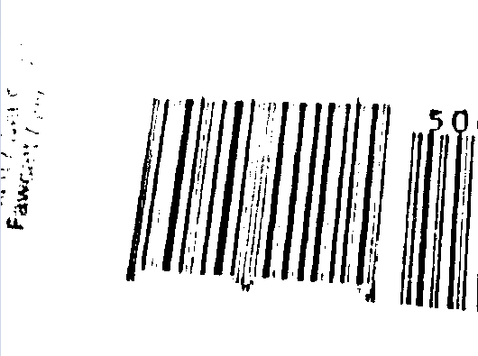

# How to read barcodes with uneven lighting

In some scenarios, the captured barcode image may have inconsistent lighting. For example, the following image shows a barcode image with uneven lighting.

<div align="center">
   <p></p>
   <p>Figure 1 – Sample barcode image with uneven lighting</p>
</div>

Converting the original barcode image to a binarized image is a very important step. DBR provides two binarization modes:
    - `BM_THRESHOLD`: uses a global threshold to binarize the image. If the gray value of the pixel is less than the threshold, it will be black in the binary image, otherwise it will be white.
    - `BM_LOCAL_BLOCK`: use a threshold for a pixel based on a small region around it.

The following two images show the effects of `BM_THRESHOLD` (global thresholding) and `BM_LOCAL_BLOCK` (local thresholding).

<div align="center">
   <p></p>
   <p>Figure 2 – Binarized image by global thresholding</p>
</div>

<div align="center">
   <p></p>
   <p>Figure 3 – Binarized image by local thresholding</p>
</div>

Obviously, the local thresholding result is much better. Now we will demonstrate how to configure the `PublicRuntimeSettings.binarizationModes` to use the `BM_LOCAL_BLOCK` binarization.

<div class="sample-code-prefix template2"></div>
   >- JavaScript
   >- Android
   >- Objective-C
   >- Swift
   >- Python
   >- Java
   >- C#
   >- C++
   >- C  
   >
>
```javascript
// Obtains the current runtime settings of DBR.
let rs = await scanner.getRuntimeSettings();
// Sets the binarization mode.
rs.binarizationModes[0] = Dynamsoft.DBR.EnumBinarizationMode.BM_LOCAL_BLOCK;
// Updates the settings.
await scanner.updateRuntimeSettings(rs);
// Fine-tunes some arguments of the first mode in `binarizationModes`
scanner.setModeArgument("binarizationModes", 0, "BlockSizeX", "0");
scanner.setModeArgument("binarizationModes", 0, "BlockSizeY", "0");
scanner.setModeArgument("binarizationModes", 0, "EnableFillBinaryVacancy", "1");
scanner.setModeArgument("binarizationModes", 0, "ThresholdCompensation", "10");
await scanner.show();
```
>
```java
// Obtain current runtime settings of `reader` instance.
PublicRuntimeSettings settings = reader.getRuntimeSettings();
// Set a binarization mode
settings.binarizationModes = new int[]{ EnumBinarizationMode.BM_LOCAL_BLOCK };
// Update the settings.
reader.updateRuntimeSettings(settings);
// Fine-tune some arguments of the first mode in `binarizationModes`
reader.setModeArgument("binarizationModes", 0, "BlockSizeX", "0");
reader.setModeArgument("binarizationModes", 0, "BlockSizeY", "0");
reader.setModeArgument("binarizationModes", 0, "EnableFillBinaryVacancy", "1");
reader.setModeArgument("binarizationModes", 0, "ThresholdCompensation", "10");
```
>
```objc
NSError* err = nil;
// Obtain current runtime settings of `reader` instance.
iPublicRuntimeSettings* settings = [reader getRuntimeSettings:&err];
// Set a binarization mode
settings.scaleUpModes = @[@(EnumBinarizationModeLocalBlock)];
// Update the settings.
[reader updateRuntimeSettings:settings error:&err];
// Fine-tune some arguments of the first mode in `binarizationModes`
[reader setModeArgument:@"binarizationModes" index:0 argumentName:@"BlockSizeX" argumentValue:"0" error:nil];
[reader setModeArgument:@"binarizationModes" index:0 argumentName:@"BlockSizeY" argumentValue:"0" error:nil];
[reader setModeArgument:@"binarizationModes" index:0 argumentName:@"EnableFillBinaryVacancy" argumentValue:"1" error:nil];
[reader setModeArgument:@"binarizationModes" index:0 argumentName:@"ThresholdCompensation" argumentValue:"10" error:nil];
```
>
```swift
// Obtain current runtime settings of `reader` instance.
let settings = try? reader.getRuntimeSettings()
// Set a binarization mode
settings!.scaleUpModes = [EnumBinarizationMode.localBlock.rawValue]
// Update the settings.
try? reader.updateRuntimeSettings(settings!)
// Fine-tune some arguments of the first mode in `binarizationModes`
try? reader.setModeArgument("binarizationModes", index: 0, argumentName: "BlockSizeX", argumentValue: "0")
try? reader.setModeArgument("binarizationModes", index: 0, argumentName: "BlockSizeY", argumentValue: "0")
try? reader.setModeArgument("binarizationModes", index: 0, argumentName: "EnableFillBinaryVacancy", argumentValue: "1")
try? reader.setModeArgument("binarizationModes", index: 0, argumentName: "ThresholdCompensation", argumentValue: "10")
```
>
```python
```
>
```java
```
>
```c#
```
>
```c++
```
>
```c
```
