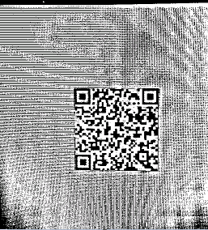

# How to read barcodes with textures

In some scenes, the background of images may appear textured, such as a pattern background, screen stripes, etc. As shown below, the barcode background has obvious screen texture.

<div align="center">
   <p></p>
   <p>Figure 1 – Sample barcode image with texture</p>
</div>

This may increase barcode localization time or even lead to localization errors. The texture detection feature of DBR works on images with textured backgrounds. The following two images demonstrate the binarized images used for localization without and with texture detection enabled:

<div align="center">
   <p></p>
   <p>Figure 2 – Binarized image without texture detection enabled</p>
</div>

<div align="center">
   <p></p>
   <p>Figure 3 – Binarized image with texture detection enabled</p>
</div>

We can configure one or more `TextureDetectionMode` in `PublicRuntimeSettings.furtherModes.textureDetectionModes` to enable texture detection feature.

<div class="sample-code-prefix template2"></div>
   >- JavaScript
   >- Android
   >- Objective-C
   >- Swift
   >- Python
   >- Java
   >- C#
   >- C++
   >- C
   >
>
```javascript
// Obtains the current runtime settings of DBR.
let rs = await scanner.getRuntimeSettings();
// Sets the text detection mode.
rs.furtherModes.textureDetectionModes[0] = Dynamsoft.DBR.EnumTextureDetectionMode.TDM_GENERAL_WIDTH_CONCENTRATION;
// Updates the settings.
await scanner.updateRuntimeSettings(rs);
// Fine-tunes `Sensitivity` of the first mode in `binarizationModes`
scanner.setModeArgument("TextureDetectionModes", 0, "Sensitivity", "5");
await scanner.show();
```
>
```java
// Obtain current runtime settings of `reader` instance.
PublicRuntimeSettings settings = reader.getRuntimeSettings();
// Enable a texture detection mode
settings.furtherModes.textureDetectionModes = new int[]{ EnumTextureDetectionMode.TDM_GENERAL_WIDTH_CONCENTRATION };
// Update the settings.
reader.updateRuntimeSettings(settings);
// Fine-tune the `Sensitivity` parameter value of the first mode in `TextureDetectionModes`
reader.setModeArgument("TextureDetectionModes", 0, "Sensitivity", "5");
```
>
```objc
NSError* err = nil;
// Obtain current runtime settings of `reader` instance.
iPublicRuntimeSettings* settings = [reader getRuntimeSettings:&err];
// Enable a texture detection mode
settings.furtherModes.textureDetectionModes = @[@(EnumTextureDetectionModeGeneralWidthConcentration)];
// Update the settings.
[reader updateRuntimeSettings:settings error:&err];
// Fine-tune the `Sensitivity` parameter value of the first mode in `TextureDetectionModes`
[reader setModeArgument:@"TextureDetectionModes" index:0 argumentName:@"Sensitivity" argumentValue:"5" error:nil];
```
>
```swift
// Obtain current runtime settings of `reader` instance.
let settings = try? reader.getRuntimeSettings()
// Enable a texture detection mode
settings!.furtherModes.textureDetectionModes = [EnumTextureDetectionMode.generalWidthConcentration.rawValue]
// Update the settings.
try? reader.updateRuntimeSettings(settings!)
// Fine-tune the `Sensitivity` parameter value of the first mode in `TextureDetectionModes`
try? reader.setModeArgument("TextureDetectionModes", index: 0, argumentName: "Sensitivity", argumentValue: "5")
```
>
```python
```
>
```java
```
>
```csharp
```
>
```c++
```
>
```c
```
