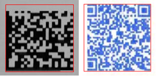

# Read Incomplete Barcodes

In some cases, barcodes may have incomplete sections due to typographical errors as shown below.

<div align="center">
   <p></p>
   <p>Incomplete Barcodes</p>
</div>

In this case, you can enable the barcode completion logic in Dynamsoft Barcode Reader (DBR) using [`BarcodeComplementModes`]({{ site.dcvb_parameters_reference }}barcode-reader-task-settings/barcode-complement-modes.html). After that, DBR will attempt to complete and correct the barcode according to the structural characteristics of the corresponding barcode type.

> NOTE:
>
> The barcode completion logic only supports QR code and Data Matrix at present.
>

## Example

Below is an example illustrating how to configure the parameter `BarcodeComplementModes`.

* Update parameter `BarcodeComplementModes` in your JSON template

    ```json
    {
        "CaptureVisionTemplates": [
            {
                "Name": "CV_0",
                "ImageROIProcessingNameArray": ["TA_0" ]
            }       
        ],
        "TargetROIDefOptions" : [
            {
                "Name": "TA_0",
                "TaskSettingNameArray": [ "BR_0" ]
            }
        ],
        "BarcodeReaderTaskSettingOptions": [
            {
                "Name" : "BR_0",
                "SectionArray": [
                    {
                        "Section": "ST_REGION_PREDETECTION",
                        "ImageParameterName": "IP_0"
                    },
                    {
                        "Section": "ST_BARCODE_LOCALIZATION",
                        "ImageParameterName": "IP_0"
                    },
                    {
                        "Section": "ST_BARCODE_DECODING",
                        "ImageParameterName": "IP_0",
                        "StageArray": [
                            {
                                "Stage": "SST_COMPLEMENT_BARCODE",
                                "BarcodeComplementModes": [
                                    {
                                        "Mode": "BCM_GENERAL"
                                    }
                                ]
                            }
                        ]
                    }
                ]
            }
        ],
        "ImageParameterOptions": [
            {
                "Name": "IP_0"
            }
        ]
    }
    ```

* Apply the above settings following the article [Use Templates for Configuring Parameters]({{ site.features }}use-runtimesettings-or-templates.html#json-template).
