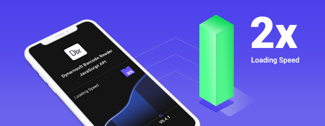

# Dynamsoft Barcode Reader - for JavaScript User Guide

  

[Dynamsoft BarcodeReader SDK for Web](https://www.dynamsoft.com/Products/barcode-recognition-javascript.aspx) is a JavaScript SDK for barcode scanning based on **WebAssembly**. It supports real-time barcode localization and decoding of various barcode types. The library is capable of scanning barcodes directly from live video streams and static images. It also supports reading multiple barcodes at once.  

In this guide, you will learn step by step how to use Dynamsoft Barcode Reader JavaScript Edition in your application:

- [Getting Started](#getting-started---hello-world)
- [Installation](#installation)
- [Basic Customizations]({{ site.js }}user-guide/basic-customizations.html)
- [Advanced Customizations]({{ site.js }}user-guide/advanced-customizations.html)
- [Deployment Activation]({{ site.js }}user-guide/deployment-activation.html)
- [Features Requirements]({{ site.js }}user-guide/features-requirements.html)
- [Upgrade]({{ site.js }}user-guide/upgrade.html)


## Getting Started - Hello World  

Let's start by using the library to build a simple web application that will decode barcodes from a live video stream.  

### Basic Requirements

- Internet connection  
- Supported Browser  
- Camera access  

### Step One: Write the code in one minute  

Create an HTML file with the following content. Deploy this to your web server and run the application over **HTTPS**.

- You will need to replace `PRODUCT-KEYS` with a trial key for the sample code to work correctly. You can acquire a trial key [here](https://www.dynamsoft.com/customer/license/trialLicense).
- If you don't have a ready-to-use web server but have a package manager like npm or yarn, you can set up a simple HTTP server in minutes. Check out `http-server` on npm or yarn.

```html
<!DOCTYPE html>
<html>
<body>
    <!-- Please visit https://www.dynamsoft.com/customer/license/trialLicense to get a trial license. -->
    <script src="https://cdn.jsdelivr.net/npm/dynamsoft-javascript-barcode@7.6.0/dist/dbr.js" data-productKeys="PRODUCT-KEYS"></script>
    <script>
        // initializes and uses the library
        let scanner = null;
        (async()=>{
            scanner = await Dynamsoft.BarcodeScanner.createInstance();
            scanner.onFrameRead = results => {console.log(results);};
            scanner.onUnduplicatedRead = (txt, result) => {alert(txt);};
            await scanner.show();
        })();
    </script>
</body>
</html>
```

[Try in JSFiddle](https://jsfiddle.net/DynamsoftTeam/pL4e7yrd/)


`onFrameRead`: This event is triggered after each single frame is scanned. The `results` object contains all the barcode results that the library found on this frame. In this example, we will print the results found in every frame to the console. 

`onUnduplicatedRead`: This event is triggered when a new barcode (not a duplicate) is found. `txt` holds the barcode text value while `result` is an object that holds details of the found barcode. In this example, an alert will be displayed for each unique barcode found. 
  

### Step Two: Enable camera access

Open the HTML page in your browser and you should see a pop-up asking for permission to access the camera. Once camera access is granted, the video stream will start in the default UI of the **BarcodeScanner** object.  

**Note**: If you don't see the pop-up, wait a few seconds for the initialization to finish.   

In this step, you might run into the following issues:

#### getUserMedia non-HTTPS access issue

If you open the HTML file as `file:///` or `http://`, the following error may appear in the browser console:

> [Deprecation] getUserMedia() no longer works on insecure origins. To use this feature, you should consider switching your application to a secure origin, such as HTTPS. See https://goo.gl/rStTGz for more details.

In Safari 12 the equivalent error is:

> Trying to call getUserMedia from an insecure document.

To access the camera with the API [getUserMedia](https://developer.mozilla.org/en-US/docs/Web/API/MediaDevices/getUserMedia), HTTPS is required.

**Note**: If you use Chrome or Firefox, you might not get the error because these two browsers allow camera access via file:/// and http://localhost.

To make sure your web application can access the camera, please configure your web server to support HTTPS. The following links may help.

- NGINX: [Configuring HTTPS servers](https://nginx.org/en/docs/http/configuring_https_servers.html)
- IIS: [Create a Self Signed Certificate in IIS](https://aboutssl.org/how-to-create-a-self-signed-certificate-in-iis/)
- Tomcat: [Setting Up SSL on Tomcat in 5 minutes](https://dzone.com/articles/setting-ssl-tomcat-5-minutes)
- Node.js: [npm tls](https://nodejs.org/docs/v0.4.1/api/tls.html)

#### Self-signed certificate issue

For testing purposes, a self-signed certificate can be used when configuring HTTPS. When accessing the site, the browser might say "the site is not secure". In this case, go to the certificate settings and set to trust this certificate.

In a production environment, you will need a valid HTTPS certificate.

### Step Three: Time to scan

Place a barcode in front of the camera. You should see an alert pop up with the decoded barcode result and a coloured region on the video to highlight the barcode location. 

## Installation

yarn

```
$ yarn add dynamsoft-javascript-barcode
```

npm

```
$ npm install dynamsoft-javascript-barcode --save
```

cdn

```
<script src="https://cdn.jsdelivr.net/npm/dynamsoft-javascript-barcode@7.6.0/dist/dbr.js" data-productKeys="PRODUCT-KEYS"></script>
<!-- or -->
<script src="https://unpkg.com/dynamsoft-javascript-barcode@7.6.0/dist/dbr.js" data-productKeys="PRODUCT-KEYS"></script>
```

Also see [Dynamsoft JavaScript Barcode SDK for Node](https://github.com/dynamsoft-dbr/node-javascript-barcode).  


## Demos and Examples

- [Online demo](https://demo.dynamsoft.com/dbr_wasm/barcode_reader_javascript.html)
- [Vue example](https://github.com/Dynamsoft/javascript-barcode/tree/master/example/web/vue)    
- [React example](https://github.com/Dynamsoft/javascript-barcode/tree/master/example/web/react)     
- [Angular example](https://github.com/Dynamsoft/javascript-barcode/tree/master/example/web/angular)  

