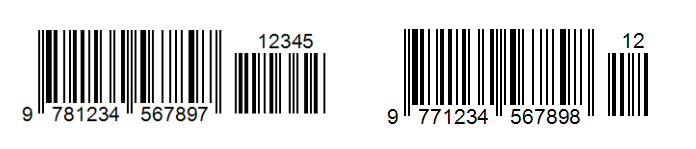

# Release Notes for Dynamsoft Barcode Reader - 10.x

## 10.4

 > First released: 07-23-2024

### Highlights

- Improved the read rate and speed of the following barcode formats:
  - EAN-13
  - DotCode
- Added support for decoding add-on codes (also known as Extension Codes) for UPC-A, UPC-E, EAN-8 and EAN-13 codes.

    

| Versions | Available Editions                                                                      |
| -------- | --------------------------------------------------------------------------------------- |
| 10.5.3000 | [JavaScript]({{ site.js_release_notes }}js-10.html#1053000-04242025){:target="_blank"} |
| 10.5.2100 | [Python]({{ site.python_release_notes}}python-10.html#1052100-12052024){:target="_blank"} |
| 10.4.3100 | [JavaScript]({{ site.js_release_notes }}js-10.html#1043100-01032025){:target="_blank"} |
| 10.4.3002 | [Android]({{ site.android_release_notes}}android-10.html#1043002-03072025){:target="_blank"} / [iOS]({{ site.oc_release_notes }}ios-10.html#1043002-03072025){:target="_blank"} |
| 10.4.3001 | [Android]({{ site.android_release_notes}}android-10.html#1043001-02112025){:target="_blank"} / [iOS]({{ site.oc_release_notes }}ios-10.html#1043001-02112025){:target="_blank"} |
| 10.4.3000 | [Android]({{ site.android_release_notes}}android-10.html#1043000-01232025){:target="_blank"} / [iOS]({{ site.oc_release_notes }}ios-10.html#1043000-01232025){:target="_blank"} |
| 10.4.2100 | [Python]({{ site.python_release_notes}}python-10.html#1042100-11072024){:target="_blank"} |
| 10.4.2003 | [Android]({{ site.android_release_notes}}android-10.html#1042003-12262024){:target="_blank"} / [iOS]({{ site.oc_release_notes }}ios-10.html#1042003-12262024){:target="_blank"} |
| 10.4.2002 | [Android]({{ site.android_release_notes}}android-10.html#1042002-12162024){:target="_blank"} / [iOS]({{ site.oc_release_notes }}ios-10.html#1042002-12162024){:target="_blank"} |
| 10.4.2001 | [Android]({{ site.android_release_notes}}android-10.html#1042001-11132024){:target="_blank"} / [iOS]({{ site.oc_release_notes }}ios-10.html#1042001-11132024){:target="_blank"} |
| 10.4.2000 | [JavaScript]({{ site.js_release_notes }}js-10.html#1042000-10102024){:target="_blank"} / [Android]({{ site.android_release_notes }}android-10.html#1042000-10112024){:target="_blank"} / [iOS]({{ site.oc_release_notes }}ios-10.html#1042000-10112024){:target="_blank"} / [Python]({{ site.python_release_notes}}python-10.html#1042000-10102024){:target="_blank"} / [.NET]({{ site.dotnet_release_notes }}dotnet-10.html#1042000-10102024){:target="_blank"} / [C++]({{ site.cpp_release_notes}}cpp-10.html#1042000-10102024){:target="_blank"} |
| 10.4.10 | [C++]({{ site.cpp_release_notes}}cpp-10.html#10410-07232024){:target="_blank"} |

## 10.2

> First released: 01-16-2024

### Highlights

* Introduced the capability for users to influence the image processing process by altering intermediate results. Users can now clone, edit, and substitute intermediate result units within the callback function of each type. Subsequent operations will then proceed based on the updated unit.
* Introduced a feature for multi-condition filtering across products. Users can now specify filtering criteria for the task results of a `TargetROIDef` by implementing an `OutputTaskSetting` based on the task results of varying products from descendant `TargetROIDef` objects.
* Enhanced the `Offset` parameter in `TargetROIDef`. Users now have the capability to meticulously customize components of the coordinate system, including the origin, X-axis, and Y-axis, for precise offset calculation.

| Versions | Available Editions |
| -------- | ------------------ |
| 10.2.12 | [.NET]({{ site.dotnet_release_notes }}dotnet-10.html#10212-06192024){:target="_blank"} |
| 10.2.11 | [Android]({{ site.android_release_notes}}android-10.html#10211-05152024){:target="_blank"} / [iOS]({{ site.oc_release_notes }}ios-10.html#10211-05152024){:target="_blank"} / [.NET]({{ site.dotnet_release_notes }}dotnet-10.html#10211-06122024){:target="_blank"} |
| 10.2.10 | [C++]({{ site.cpp_release_notes}}cpp-10.html#10210-03012024){:target="_blank"} / [.NET]({{ site.dotnet_release_notes }}dotnet-10.html#10210-05302024){:target="_blank"} / [JavaScript]({{ site.js_release_notes }}js-10.html#10210-04032024){:target="_blank"} / [Android]({{ site.android_release_notes }}android-10.html#10210-04162024){:target="_blank"} / [iOS]({{ site.oc_release_notes }}ios-10.html#10210-04162024){:target="_blank"} |
| 10.2.0 | [C++]({{ site.cpp_release_notes}}cpp-10.html#1020-01162024){:target="_blank"} |

## 10.0

> First released: 07-04-2023

### Highlights

`DynamsoftBarcodeReader` SDK has been revamped to integrate with `DynamsoftCaptureVision (DCV)` architecture, which is newly established to aggregate the features of functional products powered by Dynamsoft. The features are designed to be pluggable, customizable and interactable. In addition, the functional products share the computation so that their processing speed is much higher than working individually.

* `DynamsoftCaptureVision` architecture consists of:
  * `ImageSourceAdapter(ISA)`, the standard input interface for you to convert image data from different sources into the standard input image data. In addition, `ISA` incorporates an image buffer management system that allows instant access to the buffered image data.
  * `CaptureVisionRouter (CVR)`, an engine for you to update templates, retrieve images from `ISA`, coordinate corresponding functional products and dispatch the results to the receivers.
  * Functional products that perform image processing, content understanding and semantic processing. The functional products are pluggable and passively called by CVR when they are required.
  * Result receiver interfaces. You can implement `CapturedResultReceiver (CRR)` to receive the `CapturedResults` that output when the processing on an image is finalized. You can also implement `IntermediateResultReceiver (IRR)` to get timely results from different stages of the workflow.
* The parameter template system has been comprehensively upgraded.
  * Multiple algorithm task settings are available. You can define barcode decoding, label recognizing, document scanning and semantic processing tasks in one template file.
  * Extended the feature of the ROI system. By configuring the `target ROI` parameters, you can not only specify an `ROI` on the original image but also define the dependencies of the algorithm tasks. This feature enables you to customize the workflow when processing complex scenarios.
  * The image processing parameters are separated from the task parameters so that the template settings become more clear and concise.
* The `intermediate result` system has been improved.
  * Achieved the `intermediate result` sharing between different functional products. The results that have the same image source and processing parameters are directly reused, which speeds up the image processing workflow. You don’t need to add any additional code to enable the `intermediate result` sharing. The library can recognize all the reusable results automatically based on the template file you uploaded.
  * The readability and interactivity of the `intermediate results` are enhanced. `IntermediateResultReceiver` allows you to receive up to 27 different types of `Intermediate results`. You can clearly read which stage of the algorithm each result is output from. In addition, `IntermediateResultManager` allows you to intervene in the workflows by modifying the `intermediate results`.

| Versions | Available Editions |
| -------- | ------------------ |
| 10.0.21 | [Android]({{ site.android_release_notes }}android-10.html#10021-12122023){:target="_blank"} / [iOS]({{ site.oc_release_notes }}ios-10.html#10021-12122023){:target="_blank"} / [JavaScript]({{ site.js_release_notes }}js-10.html#10021-02052024){:target="_blank"} |
| 10.0.20 | [C++]({{ site.cpp_release_notes}}cpp-10.html#10020-10262023){:target="_blank"} / [Android]({{ site.android_release_notes }}android-10.html#10020-10262023){:target="_blank"} / [iOS]({{ site.oc_release_notes }}ios-10.html#10020-10262023){:target="_blank"} / [JavaScript]({{ site.js_release_notes }}js-10.html#10020-01292024){:target="_blank"} |
| 10.0.10 | [C++]({{ site.cpp_release_notes}}cpp-10.html#10010-08082023){:target="_blank"} |
| 10.0.0 | [C++]({{ site.cpp_release_notes}}cpp-10.html#1000-07042023){:target="_blank"} |